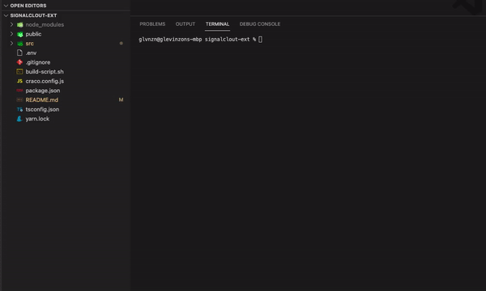
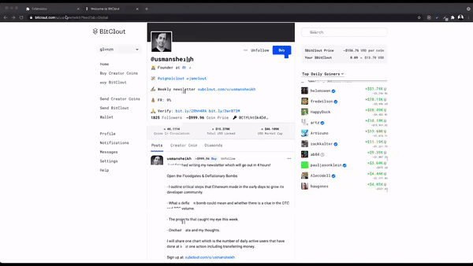
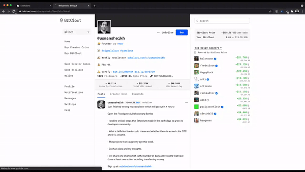
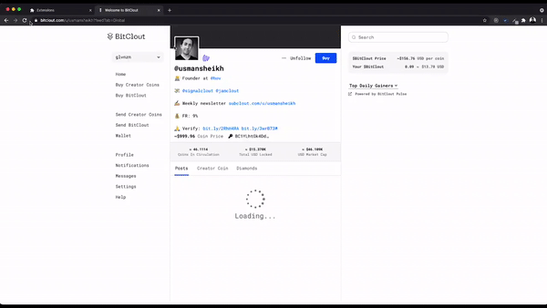
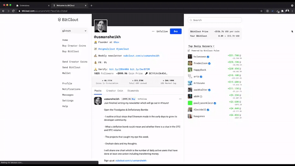
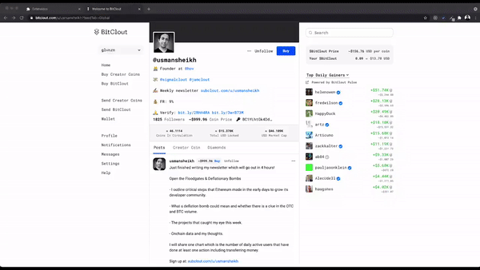

# Signalclout Chrome Extension

## Table of Contents

- [About](#about)
- [Getting Started](#getting_started)
- [Usage](#usage)
- [Demo](#demo)

## About 

[Signalclout](https://www.signalclout.com) has this very useful feature in their website - [Profile Analyzer](https://www.signalclout.com/profile-analyzer), in which you can view the [Bitclout](https://bitclout.com/) creator's profile and details by supplying the username. This tool was developed to address the pain among many users on the repetitive action of copying and pasting the username of a creator from the Bitclout website to the Signalclout profile search bar.

## Getting Started 

These instructions will get you a copy of the project up and running on your local machine for development and testing purposes.

### Prerequisites

- You’ll need to have **Node >= 10** on your local development machine
- To install packages and dependencies, run **npm install** or **yarn install**

### Installing

- Build the app for production by running this built-in command - **npm run build** or **yarn build**, this will generate a folder named `build`. 

- The build folder can now be used to install in your browser - Google Chrome, by loading it on `chrome://extensions/`. 

## Usage 

- Once done, open a tab and go to [Bitclout](https://bitclout.com) and select a profile. You will be able to see the Signalclout icon beside the creator's profile picture. 

- Click the button to view the creator's profile and details. 

- You can enable or disable the service by pressing the switch on the popup window. 

## Full Demo 
